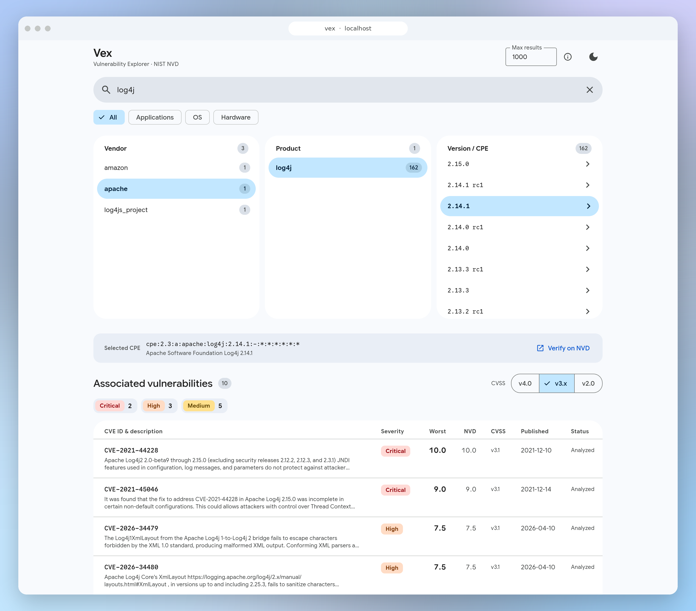

# Vex

**Vex** (Vulnerability Explorer) — a fast, clean web interface for searching CVEs via the [NIST NVD API v2.0](https://nvd.nist.gov/developers/vulnerabilities).

Navigate from vendor → product → version to find the exact CPE you need, then instantly see all associated vulnerabilities with CVSS scores, severity ratings, and full details.

  

---

## Usage

Open `index.html` directly in a browser, or serve it with any static web server (Apache, Nginx, etc.).

### Rate limits

The NVD API allows 5 requests / 30 s ([details](https://nvd.nist.gov/developers/start-here)). Responses are cached for 5 minutes to make the most of that budget.

NVD API keys raise the limit to 50 requests / 30 s, but they cannot be used here: the NVD server rejects the CORS preflight triggered by the `apiKey` header, so keyed requests never work from browser-side JavaScript.

## CPE variants

NVD often publishes several CPEs for the same version that differ only in `sw_edition`, `target_sw` or `target_hw` (e.g. `splunk:splunk` comes in enterprise, light and unqualified editions; Windows builds come per architecture). Vex surfaces this in two places:

- **Product list**: each product shows the variants its CPEs come in, as labels next to the name. `*` stands for CPEs whose variant fields are unset. A single label means every CPE of that product carries that variant.
- **Version list**: when a product has more than one variant, a row of filter chips (`All · enterprise 243 · light 49`) lets you narrow the list; each version row also carries its own variant label, so identical version numbers stay distinguishable.

The **Selected CPE** bar shows the NVD title of the chosen CPE next to its name.

## CVSS scoring

A CVE can carry several CVSS scores (NVD, the CNA that published it, ADPs) across different CVSS versions, and they often disagree, sometimes by several severity levels. Scores from different CVSS versions are on different scales and cannot be compared, so Vex handles the two dimensions separately:

- **Version**: a `v4.0 | v3.x | v2.0` selector above the table (default v3.x, remembered across sessions) decides which CVSS version drives the Score and Severity columns, the sort order and the severity counts. The selector never hides CVEs: a CVE without a score in the selected version is still listed, greyed out and placed after the others, showing the score of the newest version it does have (marked with `⚠` and excluded from the severity counts).
- **Source**: within the selected version, the **Worst** column shows the highest base score among all sources, and drives the severity badge, sorting and counts. The **NVD** column shows the score assigned by NVD analysts next to it: grey when it matches, coloured by its own severity when it disagrees, `—` when NVD has not assigned one (not yet analyzed, or only CNA/ADP scores available). The detail panel lists every score with its source, type (Primary = NVD, Secondary = CNA/ADP), version and vector.

## Data source

All vulnerability data is sourced in real time from the [NIST National Vulnerability Database](https://nvd.nist.gov/).
